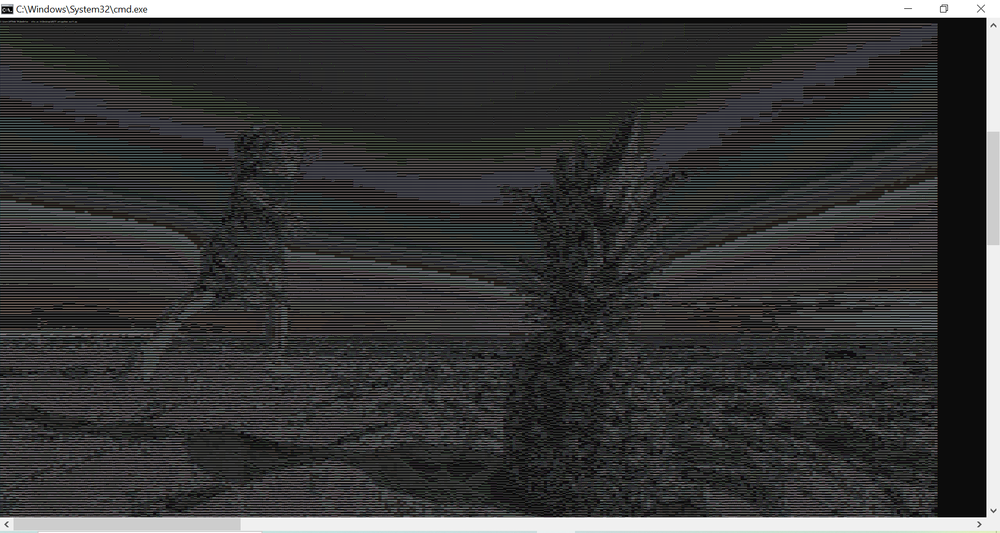
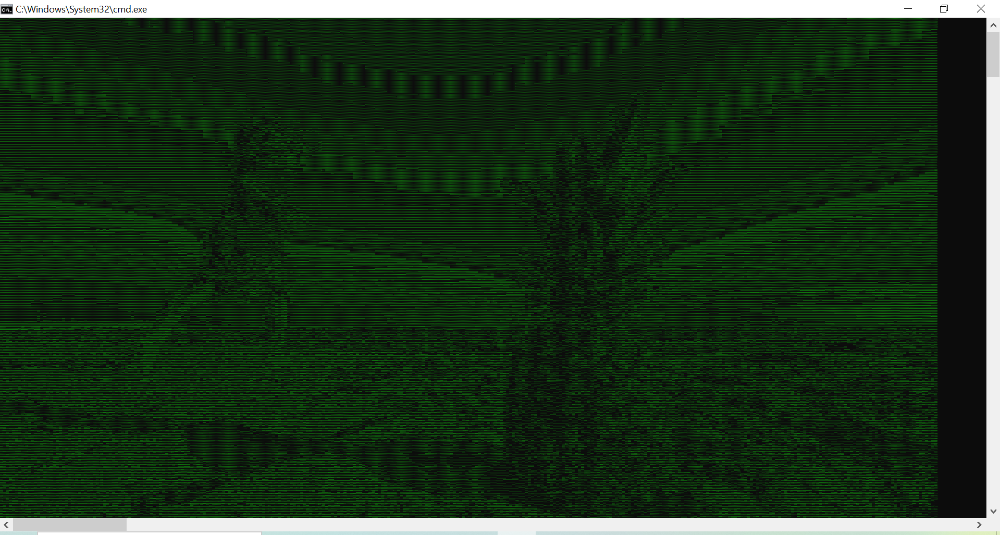

# ASCII Art Creator

This is a Python project that allows you to convert an image into ASCII art. The program takes an input image, processes it, and generates an ASCII representation of the image.

## Dependencies

- Python 3.x
- PIL (Python Imaging Library)
- Colorama (colored terminal text)

## Usage

1. Clone the repository or download the source code.
2. Install the required dependencies (`PIL` library, `colorama` library).
3. Place the image you want to convert into ASCII art in the same directory as the Python script.
4. Modify the Python script to specify the image file name.
5. Run the Python script.

## Project Structure

- `ascii.py`: The main Python script containing the logic to convert an image into ASCII art.
- `ascii-pineapple.jpg`: Example input image (can be replaced with any image of your choice).

Feel free to explore and modify the code to experiment with different image processing algorithms, character sets, or additional functionalities.

## Functionality

The project includes the following main functions:

- `get_pixel_matrix(img)`: Resizes the image to a height of 200 pixels while maintaining aspect ratio and returns a matrix representation of the image pixels.
- `get_brightness_matrix(pixel_matrix)`: Converts the rgb tuples of pixel_matrix to corresponding brightness values and returns a brightness matrix.
- `normalise_brightness_matrix(brightness_matrix)`: Normalizes the brightness values in the matrix to a range between 0 and 255.
- `get_ascii_matrix(brightness_matrix)`: Converts the normalized brightness values into ASCII characters using a predefined character set.
- `print_ascii(ascii_matrix)`: Prints the ASCII representation of the image.

## Example

Below is an example of the ASCII art generated from the provided `ascii-pineapple.jpg` image:

Below is an example of the same ASCII art generated using `colorama` library:

## Acknowledgments

The project is inspired by the concept of converting images into ASCII art and utilizes the Python Imaging Library (PIL) for image processing.
